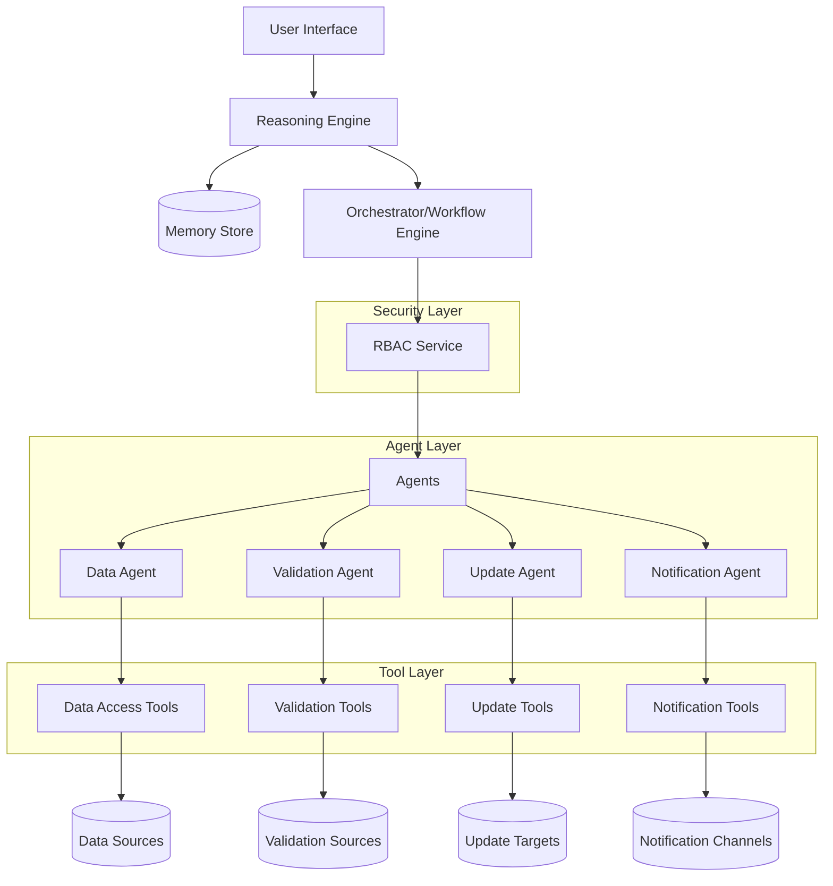
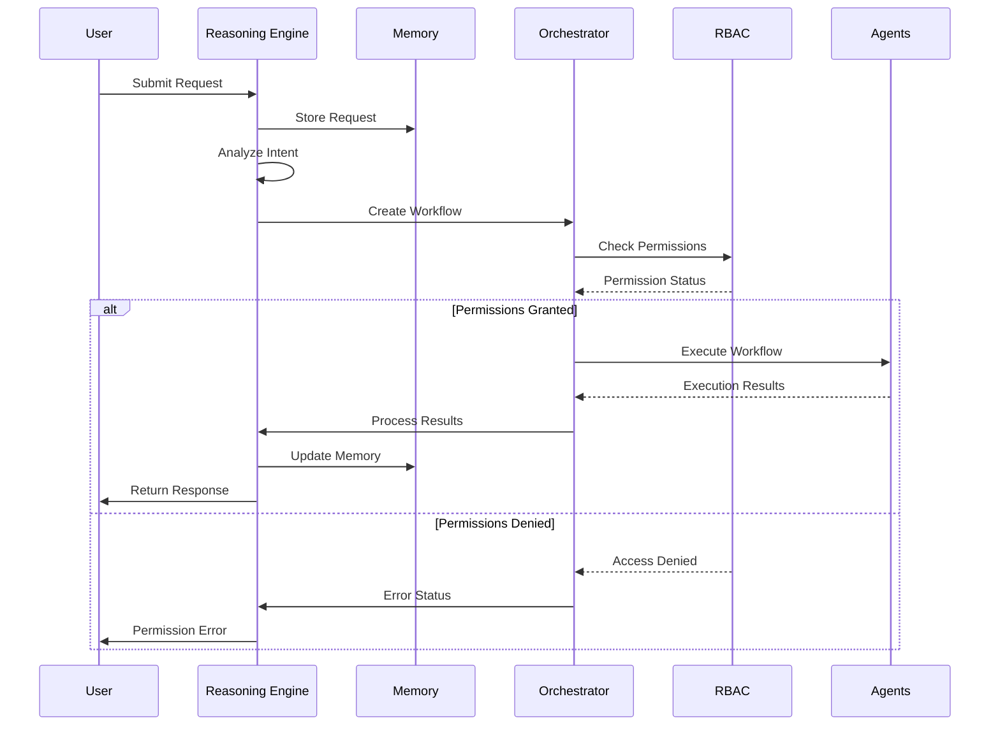
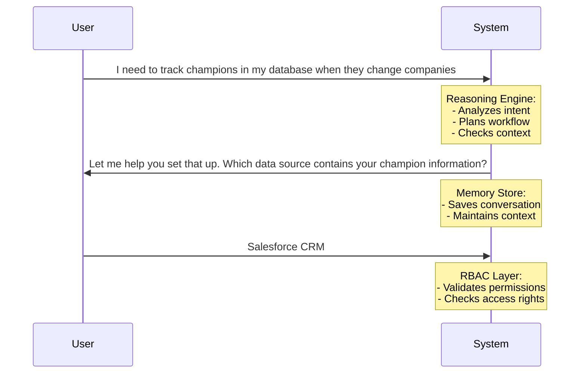
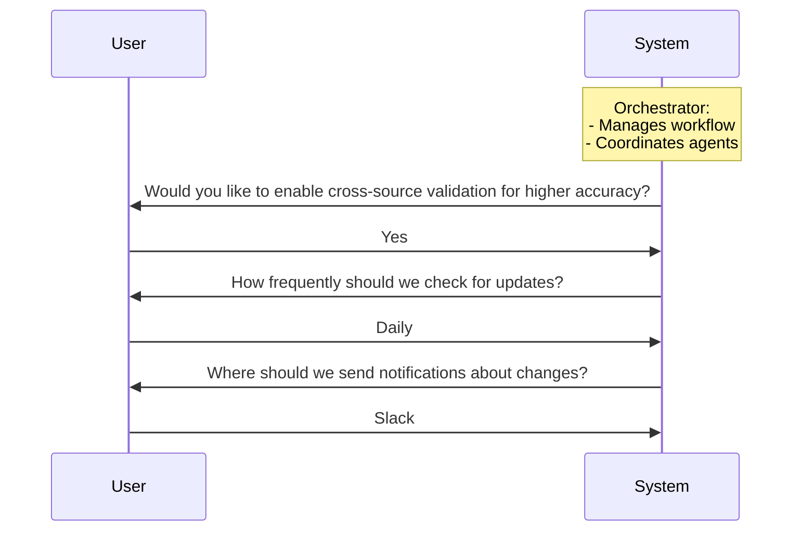
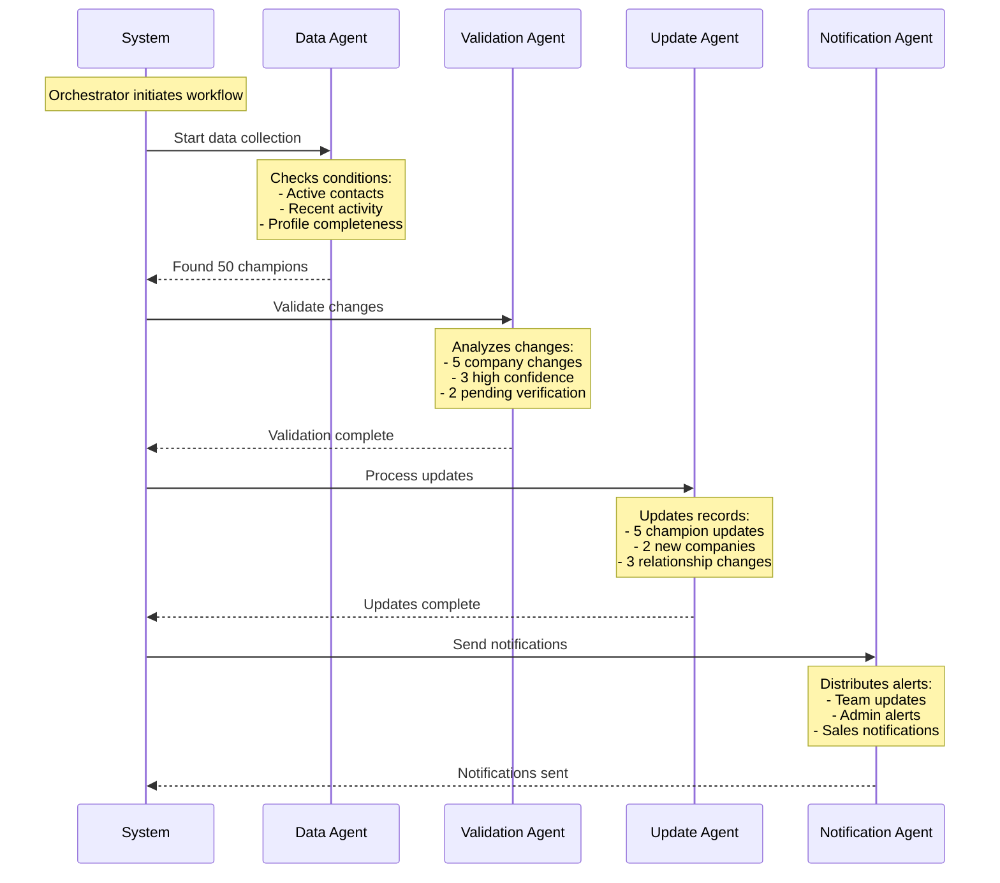

# Agentic Assistant System: Architecture and Implementation

## High-Level Architecture



## Core Components

### 1. Reasoning Engine
- Natural language understanding
- Intent classification
- Task decomposition
- Workflow planning
- Response generation

### 2. Memory Store
- Chat history persistence
- Context management
- User preferences
- Session state
- Configuration cache

### 3. Orchestrator (Workflow Engine)
- Workflow execution
- Agent coordination
- State management
- Error handling
- Recovery mechanisms

### 4. RBAC Layer
- Permission management
- Access control
- Authentication
- Authorization
- Audit logging

### 5. Agent Layer
Each agent has specific responsibilities and tools:

#### Data Agent
- Tools:
  - Database connectors
  - API clients
  - Query builders
  - Data transformers
- Responsibilities:
  - Data retrieval
  - Filtering
  - Validation
  - Formatting

#### Validation Agent
- Tools:
  - Cross-reference checkers
  - Pattern matchers
  - Verification services
  - Confidence calculators
- Responsibilities:
  - Change detection
  - Data verification
  - Source validation
  - Confidence scoring

#### Update Agent
- Tools:
  - Record updaters
  - Transaction managers
  - Relationship mappers
  - Change trackers
- Responsibilities:
  - Record updates
  - Data synchronization
  - Relationship management
  - Change logging

#### Notification Agent
- Tools:
  - Message formatters
  - Channel connectors
  - Delivery trackers
  - Template engines
- Responsibilities:
  - Alert generation
  - Channel selection
  - Message delivery
  - Status tracking

## System Flow

### Request Processing Flow



## User Interaction Example

### 1. Initial Request



### 2. Configuration Phase



**Backend Execution:**
- Reasoning Engine processes natural language input
- Breaks down request into actionable components
- Begins forming execution plan
- No external service calls yet

### 3. Execution Phase



**Backend Execution:**
- Reasoning Engine finalizes workflow plan
- Prepares to hand off to Orchestrator
- Creates execution sequence
- Defines required permissions

### 4. Orchestrator Execution
```
Orchestrator: [Executes workflow steps]
1. Sets up triggers
2. Pulls Salesforce data
3. Checks champion status
4. Updates records
5. Sends alerts
```

**Backend Execution and User Interaction:**

1. **Initial RBAC Validation:**
   ```mermaid
   sequenceDiagram
   Orchestrator->>RBAC: Validate All Required Permissions
   RBAC-->>Orchestrator: Permission Status for All Operations
   Orchestrator->>User: Display Permission Status
   ```

2. **Data Retrieval Phase:**
   ```mermaid
   sequenceDiagram
   Data Agent->>External Services: Query Data Sources
   External Services-->>Data Agent: Return Data
   Data Agent->>User: "I found 50 champions in the system. Here's what I discovered..."
   ```

3. **Validation Phase:**
   ```mermaid
   sequenceDiagram
   Validation Agent->>External Services: Verify Changes
   External Services-->>Validation Agent: Return Status
   Validation Agent->>User: "I detected 5 company changes. Here are the details..."
   ```

4. **Update Phase:**
   ```mermaid
   sequenceDiagram
   Update Agent->>External Services: Update Records
   External Services-->>Update Agent: Confirm Updates
   Update Agent->>User: "I've updated the records. Here's what changed..."
   ```

5. **Notification Phase:**
   ```mermaid
   sequenceDiagram
   Notification Agent->>External Services: Send Alerts
   External Services-->>Notification Agent: Confirm Delivery
   Notification Agent->>User: "I've sent notifications to relevant stakeholders..."
   ```

## Key Components and Their Roles

### 1. Reasoning Engine (RE)
- Processes natural language input
- Plans workflow execution
- Coordinates with Orchestrator
- Provides user feedback

### 2. Orchestrator (O)
- Manages workflow execution
- Coordinates between agents
- Ensures RBAC compliance
- Handles error scenarios

### 3. RBAC Service
- Validates permissions at each step
- Ensures security compliance
- Controls access to resources
- Maintains audit trail

### 4. Specialized Agents

#### Data Agent (DA)
- Handles data retrieval
- Processes Salesforce queries
- Manages data transformations
- Ensures data integrity

#### Validation Agent (VA)
- Verifies company changes
- Validates data consistency
- Checks business rules
- Reports validation results

#### Update Agent (UA)
- Manages record updates
- Creates new accounts
- Updates existing records
- Maintains data relationships

#### Notification Agent (NA)
- Handles alert distribution
- Manages notification preferences
- Ensures delivery confirmation
- Handles notification failures

### 5. External Services
- Salesforce integration
- oGraph status checks
- Email/notification systems
- Additional third-party services

## Security and Permissions

The system performs comprehensive RBAC validation upfront:

1. **Pre-execution Permission Check:**
   ```
   Reasoning Engine: "Before we proceed, let me verify all required permissions..."
   
   Checking permissions for:
   - Data source access
   - Record modification rights
   - Notification capabilities
   - External service access
   
   "All permissions verified. Here's what we can do..."
   ```

2. **Permission Summary:**
   The system provides a clear overview of:
   - Available operations based on permissions
   - Any restricted actions
   - Alternative approaches if needed

3. **Transparent Operation Flow:**
   After permission verification:
   - Each agent operates with pre-validated access
   - Continuous feedback to user about progress
   - Clear communication of results
   - No workflow disruption for permission checks

## Error Handling

The system implements robust error handling at multiple levels:

1. **Reasoning Engine Level:**
   - Invalid input detection
   - Workflow validation
   - Plan verification

2. **Orchestrator Level:**
   - Step execution monitoring
   - Resource availability checks
   - Recovery procedures

3. **Agent Level:**
   - Operation-specific validation
   - Error recovery mechanisms
   - Fallback procedures

4. **External Service Level:**
   - Connection error handling
   - Retry mechanisms
   - Failure notifications

## Monitoring and Logging

The system maintains comprehensive logs for:

1. **Workflow Execution:**
   - Step completion status
   - Timing information
   - Resource utilization

2. **Security Events:**
   - Permission checks
   - Access attempts
   - Authentication events

3. **Data Operations:**
   - Record updates
   - Validation results
   - Error occurrences

4. **System Health:**
   - Component status
   - Performance metrics
   - Resource utilization

This documentation provides a comprehensive overview of how the Champion Tracking System processes requests, from initial user interaction through complete workflow execution, highlighting the role of each component and the security measures in place.
