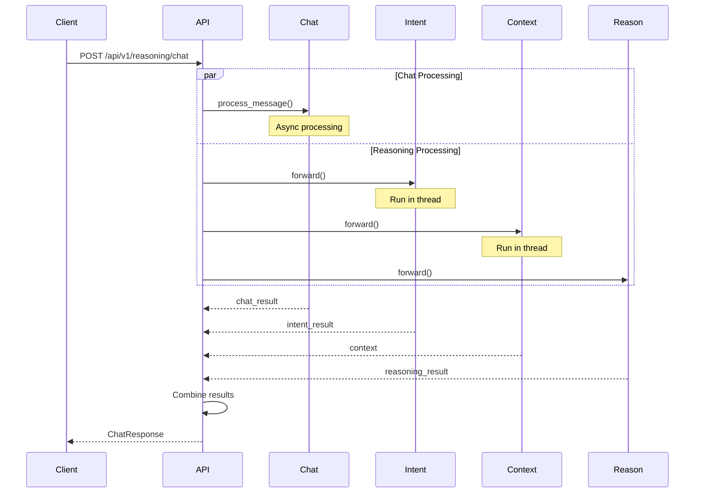
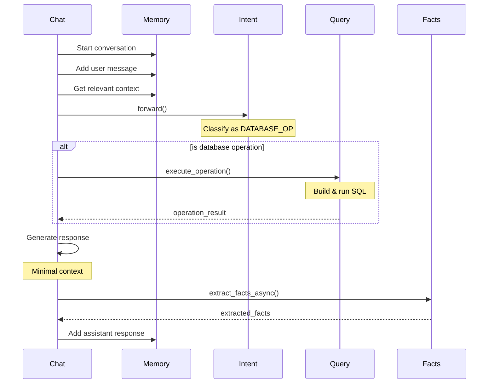
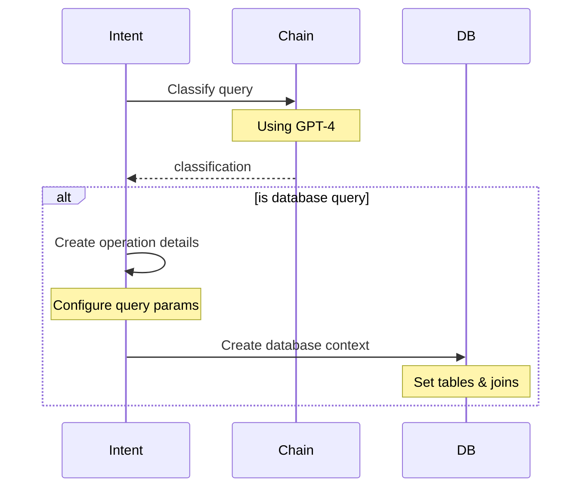
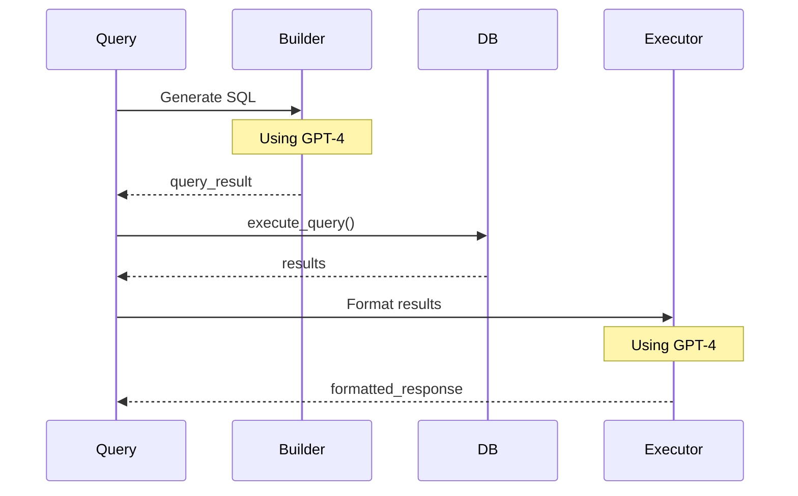

# Decision Layer Execution Flow

This document explains the detailed execution flow for the query: "Find all active customers and their recent orders"

## API Layer Flow



## Chat Processing Flow (ChatModule)



## Intent Classification Flow (IntentClassifier)



## Query Building Flow (DspyQueryBuilder)



## Detailed Module Execution

### 1. API Layer (`/api/v1/reasoning/chat`)
```python
# Timing & Tokens: None (orchestration only)
async def process_chat(request: ChatRequest):
    # 1. Process through chat module
    chat_result = await chat_module.process_message(...)
    
    # 2. Get conversation history
    conversation_history = chat_module._get_cached_history(...)
    
    # 3. Run intent classification
    intent_result = await asyncio.to_thread(intent_classifier.forward, ...)
    
    # 4. Run context analysis
    context = await asyncio.to_thread(analyzer.forward, ...)
    
    # 5. Perform reasoning
    reasoning_result = reasoner.forward(...)
    
    # 6. Return combined results
    return ChatResponse(...)
```

### 2. Chat Module Processing
```python
# Timing: Total message processing
# Tokens: Chat response generation
async def process_message(self, message: str):
    # 1. Initialize conversation
    conversation_id = self.memory_manager.start_conversation()
    
    # 2. Add user message
    self.memory_manager.add_message(...)
    
    # 3. Get context
    context = self.memory_manager.get_relevant_context(...)
    
    # 4. Classify intent
    intent_result = self.intent_classifier.forward(...)
    
    # 5. Execute database operation if needed
    if intent_result["operation_type"] == OperationType.DATABASE_OP:
        operation_result = self.query_builder.execute_operation(...)
    
    # 6. Generate chat response with minimal context
    chat_result = self.chat_chain(
        conversation_history=truncated_history,
        current_message=message,
        relevant_context={
            "intent": {
                "type": intent_result["operation_type"],
                "confidence": intent_result.get("confidence", 1.0),
                "operation_details": intent_result.get("operation_details", '')
            },
            "has_operation_result": operation_result is not None
        }
    )
    
    # 7. Extract facts
    facts = await self._extract_facts_async(...)
```

### 3. Intent Classification
```python
# Timing: Intent classification
# Tokens: GPT-4 classification
def forward(self, query: str):
    # 1. Pre-process query
    is_db_query = any(keyword in query.lower() for keyword in [
        "find", "show", "get", "list", "search", "query",
        "customers", "orders", "active", "recent"
    ])
    
    # 2. Classify using GPT-4
    result = self.classification_chain(...)
    
    # 3. Handle database operations
    if result.operation_type == OperationType.DATABASE_OP:
        # Create metadata manager
        metadata_manager = MetadataManager()
        
        # Register tables
        metadata_manager.register_table(...)
        
        # Build query context
        query_context = QueryContext(...)
```

### 4. Query Building
```python
# Timing: Query generation & execution
# Tokens: GPT-4 query building & formatting
def execute_operation(self, context: Any):
    # 1. Generate SQL using GPT-4
    query_result = self.query_builder(...)
    
    # 2. Execute query
    results = self.db_manager.execute_query(...)
    
    # 3. Format results using GPT-4
    response_result = self.query_executor(...)
```

## Performance Tracking Points

### 1. Chat Module
```json
{
    "execution_time_seconds": X.XXX,
    "chat_tokens_used": XXX,
    "dspy_module": "ChatModule.process_message",
    "conversation_id": "uuid",
    "has_operation_result": true
}
```

### 2. Intent Classification
```json
{
    "execution_time_seconds": X.XXX,
    "tokens_used": XXX,
    "dspy_module": "IntentClassifier",
    "operation_type": "DATABASE_OP"
}
```

### 3. Query Building
```json
{
    "total_execution_time_seconds": X.XXX,
    "query_generation_time_seconds": X.XXX,
    "query_execution_time_seconds": X.XXX,
    "query_builder_tokens": XXX,
    "query_executor_tokens": XXX,
    "dspy_module": "DspyQueryBuilder.execute_operation",
    "results_count": 174
}
```

### 4. Fact Extraction
```json
{
    "execution_time_seconds": X.XXX,
    "tokens_used": XXX,
    "dspy_module": "ChatModule.extract_facts_async",
    "facts_extracted": X
}
