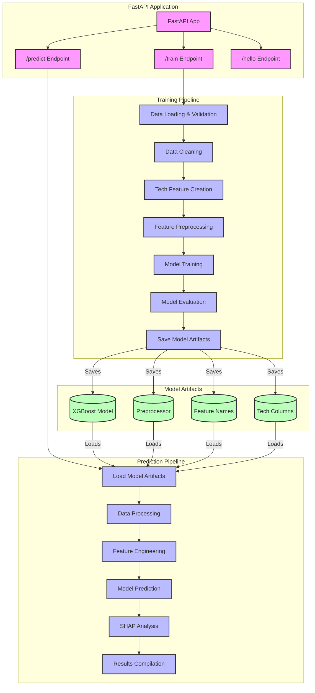

# Look-Alike Model Architecture

## API Endpoints Flow Diagram

## Endpoint Descriptions

### 1. /train Endpoint
- **Input**: CustomerData (matched and non-matched customer data)
- **Processing Steps**:
  - Data Loading & Validation
    - Processes matched and non-matched customer data
    - Validates required columns presence
  - Data Cleaning
    - Removes specified columns
    - Handles missing values
  - Tech Feature Creation
    - Processes technographic data
    - Creates binary features for technologies
  - Feature Preprocessing
    - Handles categorical features
    - Prepares feature pipeline
  - Model Training
    - Trains XGBoost classifier
    - Performs train-test split
  - Model Evaluation
    - Calculates accuracy metrics
    - Analyzes feature importance
  - Save Model Artifacts
    - Saves model, preprocessor, and feature information

### 2. /predict Endpoint
- **Input**: List of customer data for prediction
- **Processing Steps**:
  - Load Model Artifacts
    - Loads trained model and preprocessor
    - Loads feature configurations
  - Data Processing
    - Validates input data
    - Prepares account identifiers
  - Feature Engineering
    - Creates technology features
    - Aligns features with training data
  - Model Prediction
    - Generates probability scores
  - SHAP Analysis
    - Calculates feature importance
    - Analyzes technology contributions
  - Results Compilation
    - Sorts predictions
    - Formats response with detailed insights

### 3. /hello Endpoint
- Simple health check endpoint
- Returns "Hello World"

## Key Components

### Data Processing
- **Technographic Processing**
  - Converts JSON technology data to binary features
  - Handles missing/null values
  - Creates consistent feature representation

### Model Pipeline
- **XGBoost Classifier**
  - Binary classification model
  - Probability-based predictions
  - Feature importance analysis

### Feature Engineering
- **Categorical Features**
  - One-hot encoding
  - Missing value imputation
- **Technology Features**
  - Binary feature creation
  - Dynamic technology handling

### Analysis Tools
- **SHAP Analysis**
  - Feature contribution calculation
  - Technology impact assessment
  - Detailed prediction explanations

## Performance Monitoring
- Logging of processing times
- Data size tracking
- Error handling and reporting
- Performance metrics collection

This architecture ensures:
1. Robust data processing and validation
2. Consistent feature engineering
3. Reliable model training and prediction
4. Detailed insight generation
5. Performance monitoring and logging
