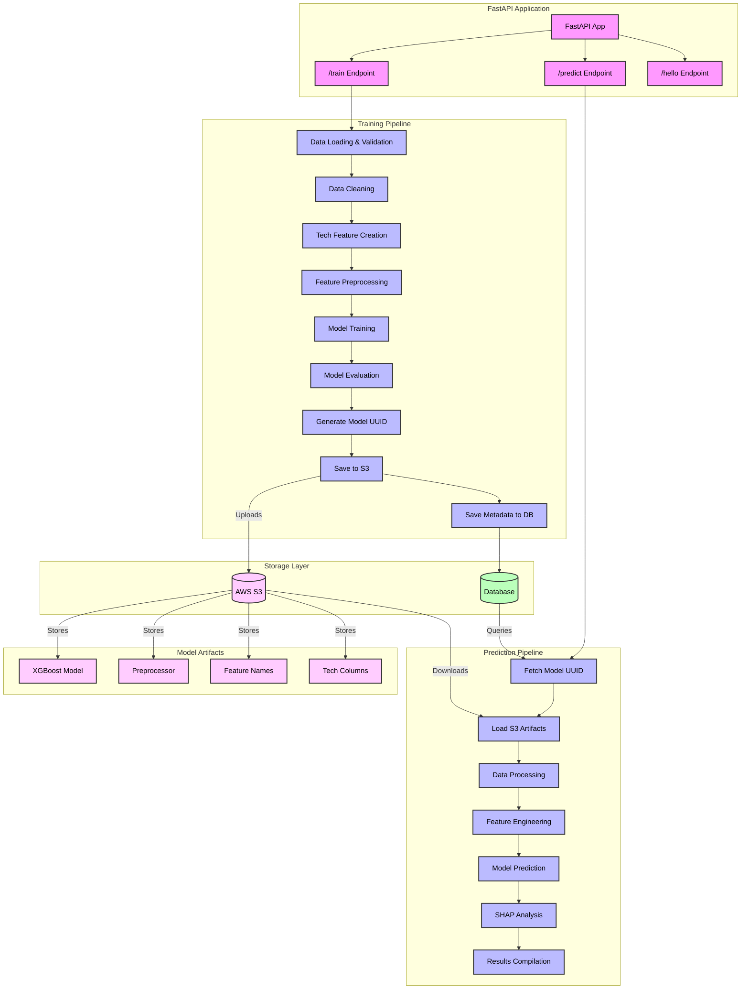

# Look-Alike Model Architecture (Optimized)

## API Endpoints Flow Diagram



## Endpoint Descriptions

### 1. /train Endpoint
- **Input**: CustomerData (matched and non-matched customer data)
- **Processing Steps**:
  - Data Loading & Validation
    - Processes matched and non-matched customer data
    - Validates required columns presence
  - Data Cleaning
    - Removes specified columns
    - Handles missing values
  - Tech Feature Creation
    - Processes technographic data
    - Creates binary features for technologies
  - Feature Preprocessing
    - Handles categorical features
    - Prepares feature pipeline
  - Model Training
    - Trains XGBoost classifier
    - Performs train-test split
  - Model Evaluation
    - Calculates accuracy metrics
    - Analyzes feature importance
  - Model Storage
    - Generates unique UUID for model
    - Uploads artifacts to S3
      - XGBoost model file
      - Preprocessor
      - Feature names
      - Tech columns
    - Saves metadata to database
      - Model UUID
      - S3 URLs for artifacts
      - Training metrics
      - Creation timestamp

### 2. /predict Endpoint
- **Input**: 
  - List of customer data for prediction
  - Model UUID (optional, defaults to latest)
- **Processing Steps**:
  - Model Artifact Retrieval
    - Queries database for model metadata
    - Downloads artifacts from S3
  - Data Processing
    - Validates input data
    - Prepares account identifiers
  - Feature Engineering
    - Creates technology features
    - Aligns features with training data
  - Model Prediction
    - Generates probability scores
  - SHAP Analysis
    - Calculates feature importance
    - Analyzes technology contributions
  - Results Compilation
    - Sorts predictions
    - Formats response with detailed insights

### 3. /hello Endpoint
- Simple health check endpoint
- Returns "Hello World"

## Storage Components

### AWS S3 Storage
- **Purpose**: Long-term storage of model artifacts
- **Structure**:
  ```
  s3://bucket-name/
    └── models/
        └── {model-uuid}/
            ├── xgboost_model.joblib
            ├── preprocessor.joblib
            ├── feature_names.joblib
            └── tech_columns.joblib
  ```
- **Benefits**:
  - Scalable storage
  - Version control
  - High availability
  - Cost-effective

### Database Schema
```sql
CREATE TABLE model_artifacts (
    id SERIAL PRIMARY KEY,
    model_uuid UUID NOT NULL UNIQUE,
    s3_model_url TEXT NOT NULL,
    s3_preprocessor_url TEXT NOT NULL,
    s3_feature_names_url TEXT NOT NULL,
    s3_tech_columns_url TEXT NOT NULL,
    accuracy FLOAT NOT NULL,
    training_metrics JSONB,
    created_at TIMESTAMP DEFAULT CURRENT_TIMESTAMP,
    is_active BOOLEAN DEFAULT true
);
```

## Key Components

### Data Processing
- **Technographic Processing**
  - Converts JSON technology data to binary features
  - Handles missing/null values
  - Creates consistent feature representation

### Model Pipeline
- **XGBoost Classifier**
  - Binary classification model
  - Probability-based predictions
  - Feature importance analysis

### Feature Engineering
- **Categorical Features**
  - One-hot encoding
  - Missing value imputation
- **Technology Features**
  - Binary feature creation
  - Dynamic technology handling

### Analysis Tools
- **SHAP Analysis**
  - Feature contribution calculation
  - Technology impact assessment
  - Detailed prediction explanations

## Performance Monitoring
- Logging of processing times
- Data size tracking
- Error handling and reporting
- Performance metrics collection
- S3 transfer monitoring
- Database query performance

## Benefits of Optimized Architecture
1. **Scalability**: S3 storage allows for unlimited model artifacts storage
2. **Versioning**: UUID-based tracking enables multiple model versions
3. **Reliability**: Cloud storage provides better durability and availability
4. **Performance**: Efficient retrieval of model artifacts
5. **Cost-effective**: Pay-per-use storage model
6. **Maintainability**: Clear separation of storage and computation
7. **Flexibility**: Support for multiple model versions and A/B testing

This optimized architecture ensures:
1. Robust model artifact management
2. Efficient storage and retrieval
3. Version control and tracking
4. High availability and durability
5. Cost-effective scaling
