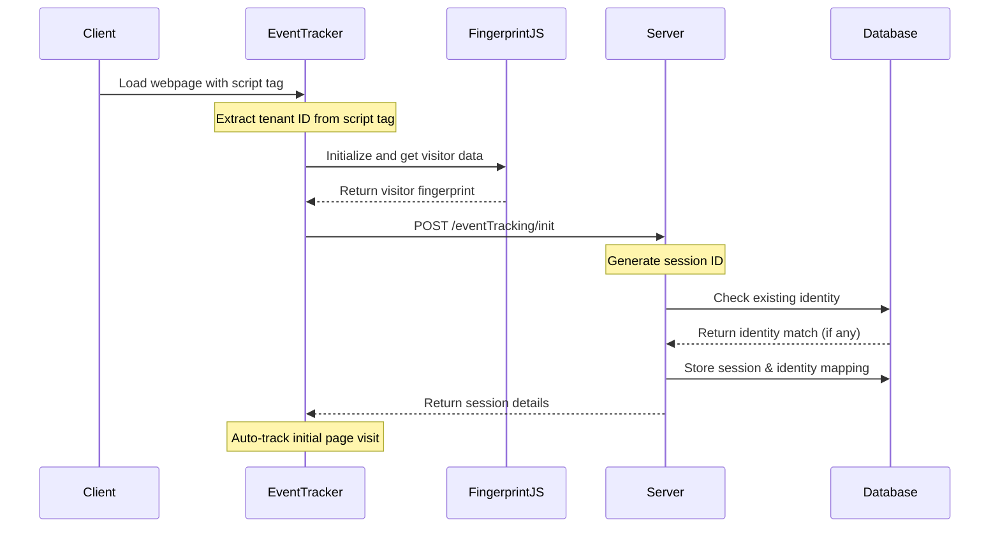
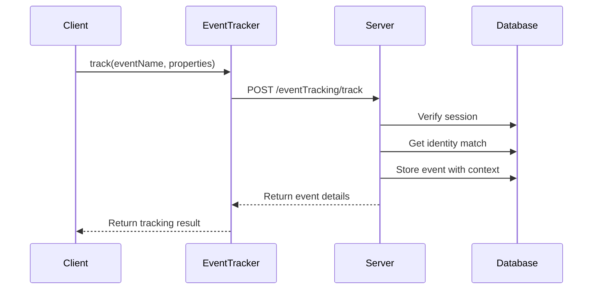
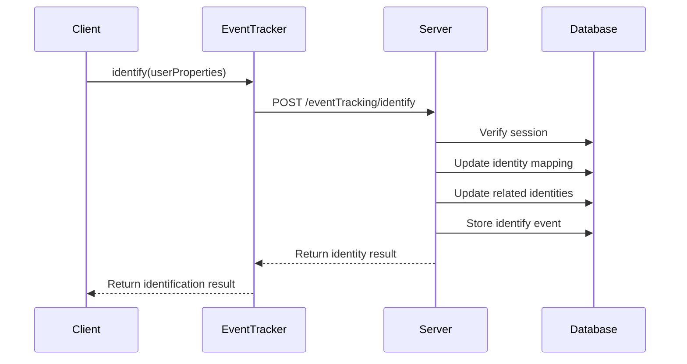

# Visitor Intelligence System Flow

## 1. System Initialization Flow

## 2. Event Tracking Flow

## 3. User Identification Flow

## Key Components

1. **Client-Side SDK (EventTracker)**
   - Initializes with tenant ID
   - Manages session state
   - Handles event tracking
   - Manages user identification

2. **FingerprintJS Integration**
   - Provides visitor fingerprinting
   - Ensures visitor uniqueness
   - Provides browser and device details

3. **Server**
   - Session management
   - Identity resolution
   - Event processing
   - Data persistence

4. **Database Schema**
   - identity_mappings: Stores visitor identities
   - session_mappings: Manages active sessions
   - events: Stores all tracked events

## Scenarios

### Scenario 1: New Visitor
1. User visits website for first time
2. System generates unique fingerprint
3. No existing identity found
4. Creates new session
5. Tracks initial page visit
6. Confidence score: 1.0 (fresh fingerprint)

### Scenario 2: Returning Visitor (Fingerprint Match)
1. User returns to website
2. System recognizes fingerprint
3. Finds existing identity
4. Links session to existing identity
5. Confidence score: 0.8+ (fingerprint match)
6. Maintains consistent identity across sessions

### Scenario 3: Returning Visitor (IP + Browser Match)
1. User visits from same IP/browser
2. No exact fingerprint match
3. System finds IP + browser correlation
4. Links to probable existing identity
5. Confidence score: 0.6 (IP + browser match)
6. Updates identity mapping

### Scenario 4: User Identification
1. User logs in or provides information
2. System calls identify() with user data
3. Updates primary identity mapping
4. Updates related identities (same IP/browser)
5. Retroactively updates previous events
6. Maintains identity across future sessions

### Scenario 5: Cross-Device Tracking
1. User accesses from different devices
2. Different fingerprints generated
3. User identifies on new device
4. System maintains separate fingerprints
5. Links both to same identity
6. Enables cross-device user journey tracking

## Identity Resolution Logic

1. **Primary Match Methods:**
   - Exact fingerprint match (Highest confidence)
   - IP + Browser correlation (Medium confidence)
   - IP-only match (Lower confidence)

2. **Confidence Scoring:**
   - Fingerprint match: 0.8-1.0
   - IP + Browser match: 0.6
   - IP-only match: 0.4
   - New visitor: 1.0

3. **Identity Propagation:**
   - Updates related sessions
   - Maintains historical consistency
   - Preserves identity across devices

## Security Measures

1. **Visitor Verification:**
   - Validates fingerprint data
   - Verifies visitor IDs
   - Prevents identity spoofing

2. **Data Protection:**
   - Tenant isolation
   - Session validation
   - Secure identity storage

## Event Enrichment

Each event is enriched with:
- Session context
- Identity information
- Browser details
- IP address
- Geolocation data
- ASN information
- Confidence scores
- Timestamp data
